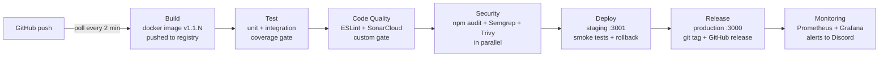

# 🔐 MedVault - Zero Trust Patient Access System

> **ACUCyS × DSEC Hackathon 2026** · *"Trust No One, Treat Everyone"*

A zero trust patient data access system for healthcare. Every clinician sees **only the patient data relevant to their role and treatment context** - nothing more, nothing less.

---

## The Problem

In most hospital systems, once authenticated, a clinician can access far more data than needed. A physio might view psychiatric notes. An admin scheduler might read lab results. This over-permissioning creates real risk: one compromised account exposes everything.

**Zero trust** flips the model - trust no one by default, then grant minimum necessary access based on role and context.

---

## What Each Role Sees

| Role | Sees | Cannot See |
|------|------|------------|
| **ER Doctor** | Allergies · Meds · Vitals · Imaging | Psych · Surgical history · Labs · Billing |
| **Nurse** | Vitals · Active med names · Allergies | Labs · Imaging · Surgical · Psych |
| **Admin** | Demographics · Insurance · Next of kin | Medical records · Meds · Psych · Vitals |
| **Psychiatrist** | Psych notes & medications only | All physical records |
| **Surgeon** | Allergies · Meds · Surgical hx · Labs · Imaging | Psych · Admin/billing |

Every access attempt is **logged, timestamped, and auditable** in real time.

---

## Tech Stack

| Layer | Tech |
|-------|------|
| Backend | Node.js + Express |
| Sessions | `express-session` |
| Patient data | `@faker-js/faker` (20 patients generated on startup) |
| Frontend | Vanilla HTML / CSS / JS |
| Fonts | Syne + JetBrains Mono |
| Tests | Vitest + Supertest |
| Metrics | prom-client (Prometheus) |

No database required - everything runs in memory.

---

## DevOps pipeline (SIT223 7.3HD)



| Stage | Tools | Gate (build fails if...) |
|---|---|---|
| Build | npm, Docker, local registry | image doesnt build or push |
| Test | Vitest, Supertest | any test fails or coverage < 85% lines |
| Code Quality | ESLint, SonarCloud, `scripts/quality-gate.mjs` | any lint warning, or SonarCloud metrics break `quality-gate.json` |
| Security | npm audit, Semgrep (custom rules), Trivy 0.69.3 | HIGH/CRITICAL fixable vuln, secret, root container, or blocking SAST finding |
| Deploy | Docker Compose, `scripts/deploy.sh` | staging never gets healthy (auto rollback) or smoke tests fail |
| Release | Docker tags, git tags, GitHub Releases API | prod unhealthy (auto rollback) or prod smoke tests fail |
| Monitoring | Prometheus, Alertmanager, Grafana, Blackbox exporter | prod isnt being scraped or no alert rules loaded |

### URLs once it's running

| What | URL |
|---|---|
| Jenkins | http://localhost:8080 |
| MedVault production | http://localhost:3000 |
| MedVault staging | http://localhost:3001 |
| Grafana | http://localhost:3030 |
| Prometheus | http://localhost:9090 |
| Alertmanager | http://localhost:9093 |
| Docker registry | http://localhost:5000/v2/medvault/tags/list |

### Run it

```bash
cp infra/.env.example infra/.env      # fill in the tokens
docker compose -f infra/docker-compose.yml up -d --build
# open http://localhost:8080, New Item > Pipeline > "Pipeline script from SCM" > this repo
```

### Run the app on its own

```bash
npm install
npm start          # http://localhost:3000
npm test           # unit + integration tests
npm run lint
```

## Project Structure

```
medvault/
├── server/
│   ├── index.js                    # Express entry point + in-memory DB
│   ├── seed.js                     # Faker patient data generator
│   ├── middleware/
│   │   └── accessControl.js        # Zero trust RBAC - the core logic
│   └── routes/
│       ├── auth.js                 # Login / logout / session
│       ├── patients.js             # Patient API (role-filtered responses)
│       └── audit.js                # Access log API
├── public/
│   ├── index.html                  # Single-page app shell
│   ├── css/
│   │   └── main.css                # Full design system
│   └── js/
│       ├── api.js                  # Fetch wrapper
│       ├── app.js                  # Bootstrap + screen switching
│       ├── login.js                # Login screen logic
│       ├── dashboard.js            # Topbar + patient list + search
│       ├── patient.js              # Patient record renderer
│       └── audit.js                # Live audit log drawer
├── package.json
└── README.md
```

---

## API Reference

### Auth
| Method | Endpoint | Description |
|--------|----------|-------------|
| `POST` | `/api/auth/login` | Authenticate with `{ role, context }` |
| `POST` | `/api/auth/logout` | End session |
| `GET`  | `/api/auth/me` | Current session info |

### Patients
| Method | Endpoint | Description |
|--------|----------|-------------|
| `GET` | `/api/patients` | Patient list (safe fields only) |
| `GET` | `/api/patients/:id` | Full record - server filters by role |
| `GET` | `/api/patients/:id/field/:field` | Single field access (logged + enforced) |
| `GET` | `/api/patients/:id/permissions` | What this role can/cannot see |

### Audit
| Method | Endpoint | Description |
|--------|----------|-------------|
| `GET` | `/api/audit` | Paginated access log |
| `GET` | `/api/audit/stats` | Summary counts |

---

## Zero Trust Design Principles Applied

1. **Deny by default** - if a field isn't in `allowedFields`, the server never sends it
2. **Minimum necessary access** - each role gets only what their function requires
3. **Context recording** - treatment context is captured with every session
4. **Full audit trail** - every view, field access, and denial is logged with role + timestamp
5. **Server-side enforcement** - filtering happens on the server, not the client

---

## Extending This Project

- **Real database** → replace the in-memory `db` with PostgreSQL + Prisma
- **JWT auth** → swap `express-session` for stateless JWT tokens
- **Time-scoped access** → auto-expire ER doctor access after a shift ends
- **Attribute-based control (ABAC)** → add department, location, or time-of-day rules
- **Breach simulation mode** → toggle showing "full access" vs "scoped" side by side

---

*Built for ACUCyS × DSEC Hackathon 2026. "Trust No One, Treat Everyone."*

---

*AI assistance: parts of the pipeline, tests and configuration were built with help from Claude (Anthropic). See the report for details.*
